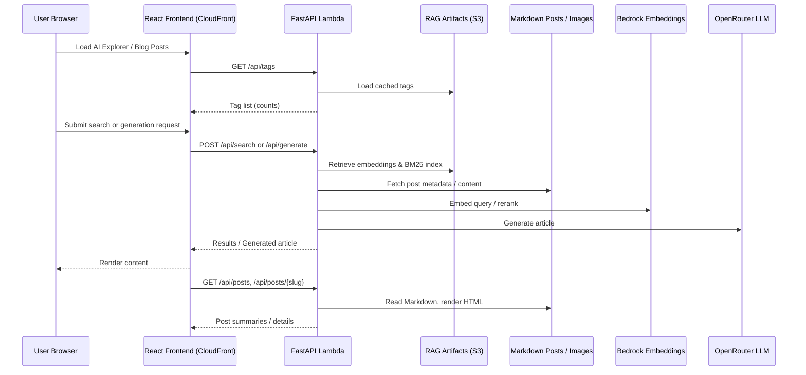

# Application Interaction Flow

> **Overview:** The React frontend calls the Lambda-backed FastAPI API via CloudFront. Lambda reads RAG artifacts from S3, Markdown content from the packaged assets/S3, uses Bedrock for embeddings, and invokes OpenRouter for article generation before returning data to the client.
