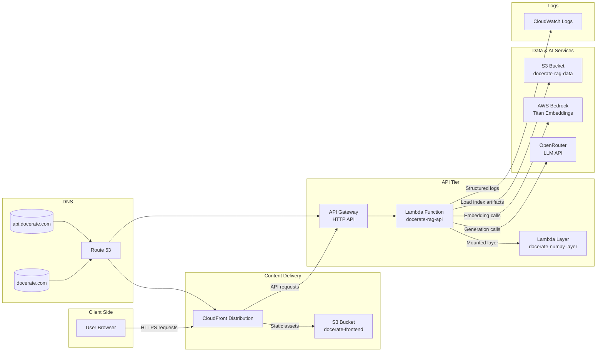

# Project Infrastructure Overview

> **Note:** Route 53 routes `docerate.com` and `api.docerate.com` to CloudFront and API Gateway respectively. Lambda reads pre-generated RAG artifacts from `docerate-rag-data` and uses Bedrock for embeddings plus OpenRouter for article generation.
