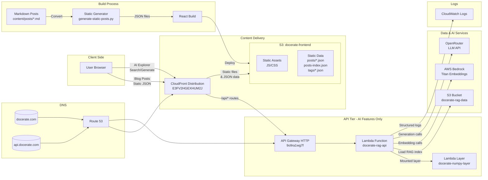

# Project Infrastructure Overview



## Performance Optimization Details

### Static Blog Content (New)
- **Blog posts** are converted from Markdown to JSON at **build time**
- Served directly from **CloudFront edge cache** (no Lambda calls)
- Cache headers:
  - Static posts: 1 hour (`max-age=3600`)
  - index.html: 5 minutes (`max-age=300`)
  - JS/CSS assets: 1 year (`max-age=31536000`)

### Dynamic AI Features
- **AI Explorer** continues to use Lambda API
- Endpoints: `/api/search`, `/api/generate`, `/api/tags`
- Lambda only processes **RAG queries** and **content generation**
- No longer serves blog post content

### Build & Deployment Flow
1. `generate-static-posts.py` converts Markdown → JSON
2. React build bundles app with static data
3. Deploy to S3 with optimized cache headers
4. CloudFront invalidation for immediate updates

### URLs & Endpoints
- **Production URL**: https://d2w8hymo03zbys.cloudfront.net
- **API Gateway**: https://9o9ra1wg7f.execute-api.us-east-1.amazonaws.com/prod
- **CloudFront Distribution**: E3FV2HGEXHUM2J
- **S3 Buckets**:
  - Frontend: `docerate-frontend`
  - RAG Data: `docerate-rag-data`

### Data Flow Comparison

#### Before (All Dynamic)
```
User → CloudFront → API Gateway → Lambda → S3 → Parse Markdown → Response
Time: ~2-3 seconds (cold start)
```

#### After (Hybrid Static/Dynamic)
```
Blog Posts: User → CloudFront Edge Cache → Static JSON
Time: <100ms

AI Features: User → CloudFront → API Gateway → Lambda → RAG Processing
Time: ~500ms-2s (only for AI features)
```

> **Note:** This hybrid architecture delivers **static blog performance** (<100ms) while maintaining **dynamic AI capabilities**. Blog posts load instantly from CloudFront edge locations worldwide, while Lambda handles only AI-powered features, reducing cold starts by ~90%.