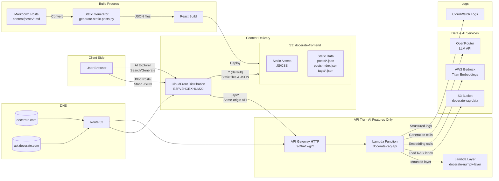

# Project Infrastructure Overview



## Performance Optimization Details

### Static Blog Content (New)
- **Blog posts** are converted from Markdown to JSON at **build time**
- Served directly from **CloudFront edge cache** (no Lambda calls)
- Cache headers:
  - Static posts: 1 hour (`max-age=3600`)
  - index.html: 5 minutes (`max-age=300`)
  - JS/CSS assets: 1 year (`max-age=31536000`)

### Dynamic AI Features
- **AI Explorer** uses Lambda API through CloudFront (same-origin)
- Endpoints: `/api/search`, `/api/generate`, `/api/tags`
- Lambda only processes **RAG queries** and **content generation**
- No longer serves blog post content

### CloudFront API Routing (No CORS!)
- CloudFront has **two origins**:
  1. **S3 origin** (`docerate-frontend`) - serves static content
  2. **API Gateway origin** (`9o9ra1wg7f.execute-api.us-east-1.amazonaws.com`) - serves API
- **Cache behavior** routes `/api/*` → API Gateway origin
- **Benefits**:
  - ✅ Single domain (same-origin) - **no CORS needed**
  - ✅ Cleaner backend code (no CORS middleware)
  - ✅ Better security (single entry point)
  - ✅ Edge caching available for API if needed

### Build & Deployment Flow
1. `generate-static-posts.py` converts Markdown → JSON
2. React build bundles app with static data
3. Deploy to S3 with optimized cache headers
4. CloudFront invalidation for immediate updates

### URLs & Endpoints
- **Production URL**: https://d2w8hymo03zbys.cloudfront.net
- **API Gateway**: https://9o9ra1wg7f.execute-api.us-east-1.amazonaws.com/prod
- **CloudFront Distribution**: E3FV2HGEXHUM2J
- **S3 Buckets**:
  - Frontend: `docerate-frontend`
  - RAG Data: `docerate-rag-data`

### Data Flow Comparison

#### Before (Direct API Gateway - CORS Required)
```
User → CloudFront (d2w8hymo03zbys.cloudfront.net) → Frontend
User → API Gateway (9o9ra1wg7f.execute-api.us-east-1.amazonaws.com) → Lambda
        ↑ Different domains = CORS complexity
```

#### After (Unified CloudFront - No CORS)
```
Blog Posts:
  User → CloudFront → /* → S3 → Static JSON
  Time: <100ms

AI Features:
  User → CloudFront → /api/* → API Gateway → Lambda → RAG Processing
  Time: ~500ms-2s (only for AI features)
        ↑ Same domain (cloudfront) = No CORS needed!
```

### Local Development (Also No CORS)
```
User → localhost:3000 (React dev server)
         ├─ /static/* → React app
         └─ /api/*    → Proxy to localhost:5000 (FastAPI)
                        ↑ Same origin via proxy - No CORS!
```

> **Note:** This hybrid architecture delivers **static blog performance** (<100ms) while maintaining **dynamic AI capabilities**. Blog posts load instantly from CloudFront edge locations worldwide, while Lambda handles only AI-powered features, reducing cold starts by ~90%. The unified CloudFront routing eliminates CORS entirely in both production and development.