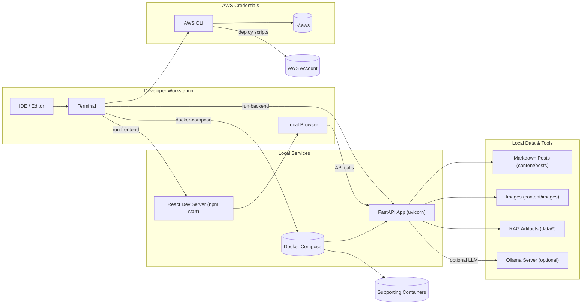

# Local Development Setup

> **Usage:** run `npm start` inside `rag-frontend/` for the React UI and `uvicorn backend.main:app --reload` (or `docker-compose up`) for the FastAPI backend. Local content, images, and RAG artifacts are loaded from the repository’s `content/` and `data/` directories.
