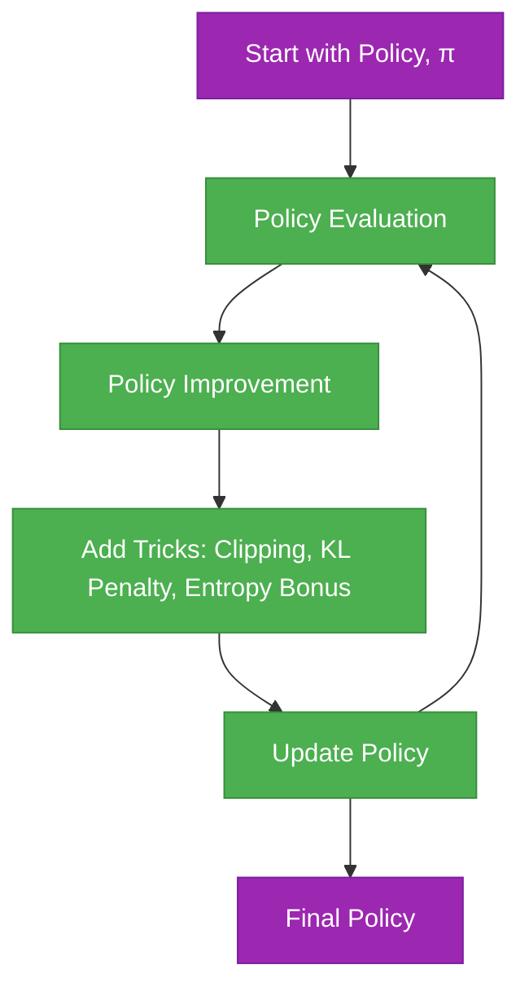
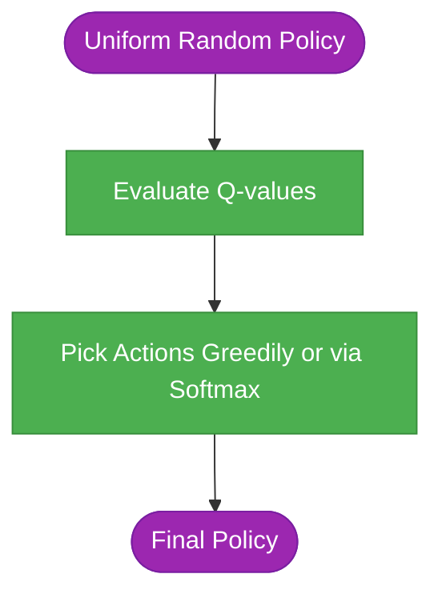
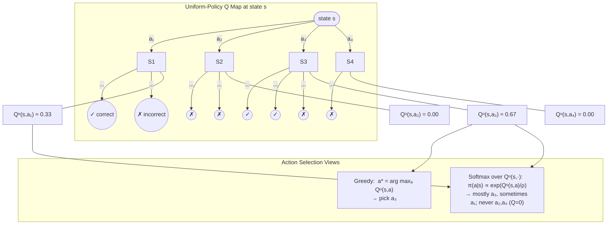

```mermaid
flowchart TD
    A[Start with Policy, π] --> B[Policy Evaluation]
    B --> C[Policy Improvement]
    C --> D[Add Tricks: Clipping, KL Penalty, Entropy Bonus]
    D --> E[Update Policy]
    E --> B
    E --> F[Final Policy]

    classDef process fill:#4caf50,stroke:#388e3c,color:#fff;
    classDef decision fill:#ff9800,stroke:#f57c00,color:#fff;
    classDef terminator fill:#9c27b0,stroke:#7b1fa2,color:#fff;

    class A,F terminator;
    class B,C,D,E process;
```

```mermaid
flowchart TD
    A([Uniform Random Policy]) --> B[Evaluate Q-values]
    B --> C[Pick Actions Greedily or via Softmax]
    C --> D([Final Policy])

    classDef process fill:#4caf50,stroke:#388e3c,color:#fff;
    classDef terminator fill:#9c27b0,stroke:#7b1fa2,color:#fff;

    class A,D terminator;
    class B,C process;
```

```mermaid
flowchart TB
    %% --- Title
    subgraph R["Uniform-Policy Q Map at state s"]
    direction TB

    S(["state s"])

    %% First-layer actions
    S -->|a₁| S1
    S -->|a₂| S2
    S -->|a₃| S3
    S -->|a₄| S4

    %% Second layer for illustrative branching
    S1 -->|...| G1(("✓ correct"))
    S1 -->|...| B1(("✗ incorrect"))

    S2 -->|...| B2a(("✗"))
    S2 -->|...| B2b(("✗"))

    S3 -->|...| G3a(("✓"))
    S3 -->|...| G3b(("✓"))
    S3 -->|...| B3(("✗"))

    S4 -->|...| B4(("✗"))

    end

    %% --- Q labels mirroring "success probability" under uniform random rollouts
    Q1["Qᵘ(s,a₁) ≈ 0.33"]
    Q2["Qᵘ(s,a₂) = 0.00"]
    Q3["Qᵘ(s,a₃) ≈ 0.67"]
    Q4["Qᵘ(s,a₄) = 0.00"]

    S1 --- Q1
    S2 --- Q2
    S3 --- Q3
    S4 --- Q4

    %% --- Greedy vs Softmax views
    subgraph G["Action Selection Views"]
    direction LR
      GA["Greedy:  a* = arg maxₐ Qᵘ(s,a)\n→ pick a₃"]
      GB["Softmax over Qᵘ(s,·):  π(a|s) ∝ exp(Qᵘ(s,a)/ρ)\n→ mostly a₃, sometimes a₁; never a₂,a₄ (Q=0)"]
    end

    %% Connect views to Q map
    Q3 --> GA
    Q1 --> GB
    Q3 --> GB
```
